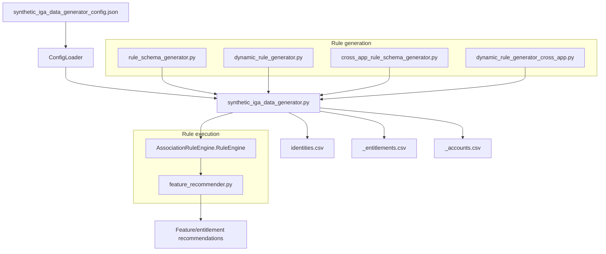

# IGA Data Generator Architecture

This diagram summarizes how the synthetic IGA data generator loads configuration, generates rules, and emits datasets.

## Notes
- `synthetic_iga_data_generator.py` is the primary entry point; it orchestrates configuration loading, rule ingestion, and dataset output.
- Rule generators produce association rules (per-app or cross-app) that the `AssociationRuleEngine` loads to drive entitlement assignments.
- The generator emits identity records plus per-application entitlement catalogs and account assignments.
